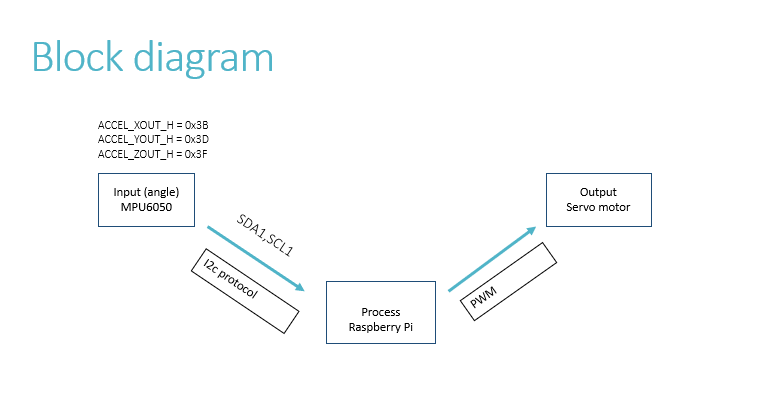
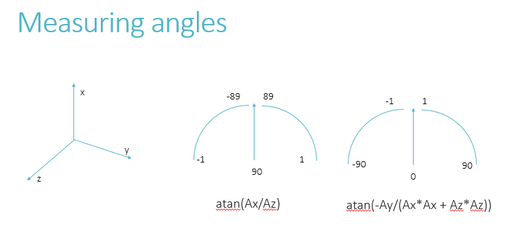
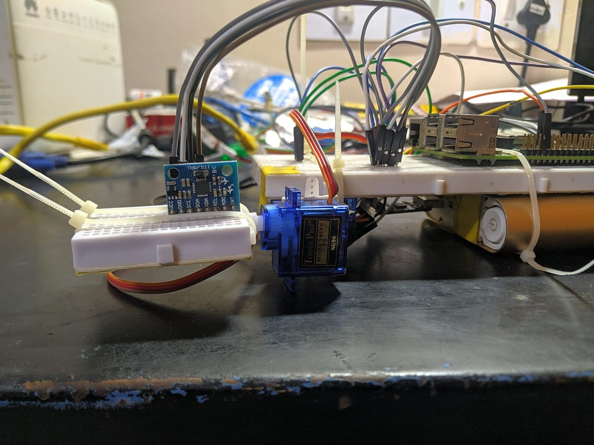
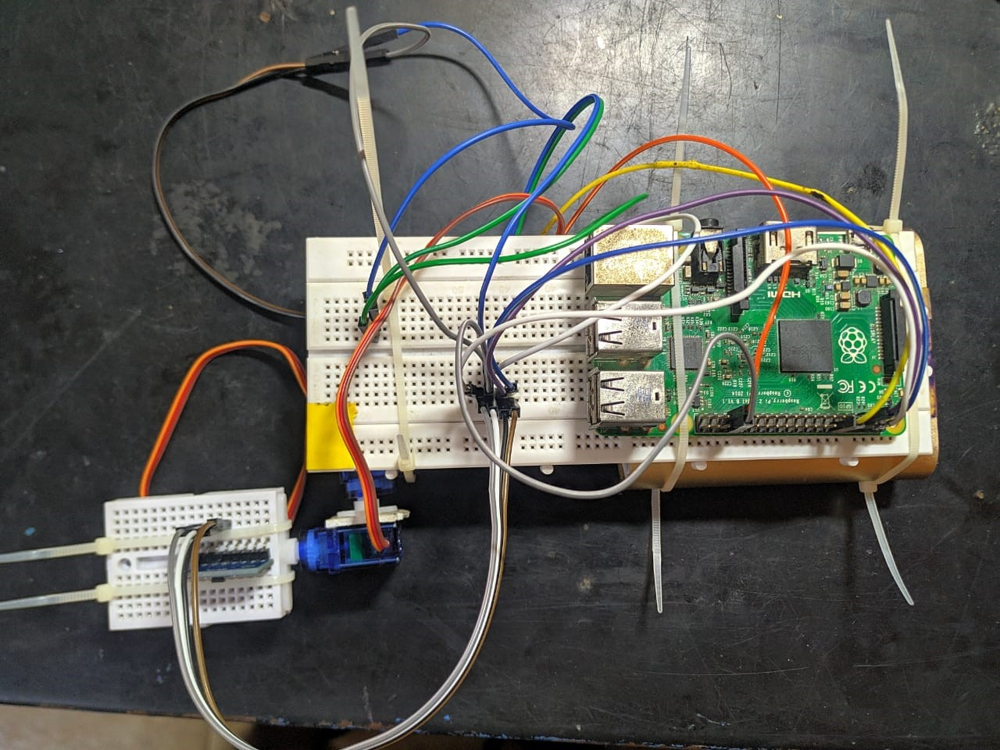
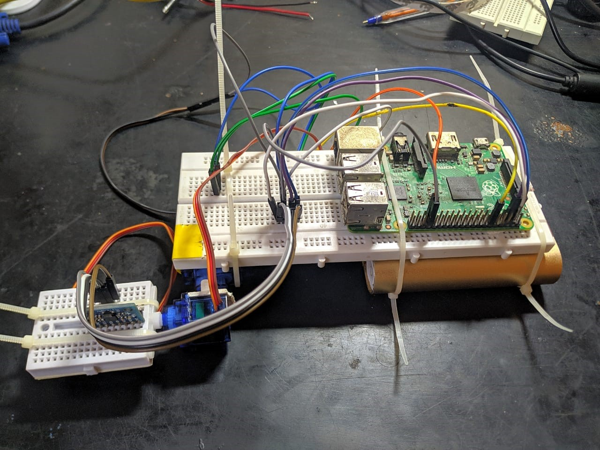

# 2-axis-stabilizing-platform
The aim is to create a self stabilizing platform which takes the instantenous change in angle of the platform as an input and produces an opposing torque to cancel its effect and hence stabilizing the platform on two axes using a PID controller feedback system.

# Components
1) Raspberry Pi  (https://pypi.org/project/simple-pid/ for pid controller library )  
2) SG90 Servos (x2)  
3) MPU6050(i2c gyroscope, please refer to the datasheet for confiuration according to your requirement)  
4) Wires, breadboard and support structures  

# Block Diagram
  

# Angle measurements in terms of acceleration (Ax,Ay,Az)
  

# Model images
  
  
  
